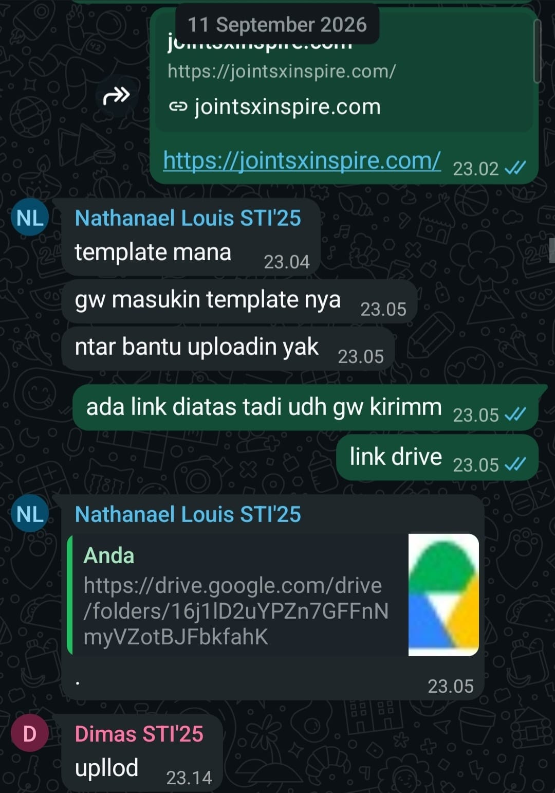

## Kompetensi target

Membedakan person, personality, dan character serta memilih objective, repertoire, dan language yang sesuai.

## Evidence wajib

- Lima character dari sedikitnya tiga domain kehidupan.
- Objective, responsibility, repertoire, dan risiko tiap character.
- Satu contoh perubahan language ketika character berubah.

::: {.callout-tip title="Lihat contoh pengisian"}
[Buka contoh fiktif Minggu 1](../examples/week-01.qmd) untuk melihat tingkat kekonkretan evidence dan analisis. Jangan menyalin contoh sebagai evidence pribadi.
:::

## Lima Character - Peta Karakter Komunikasi Pribadi

Dalam peta ini, **person** berarti manusia utuh yang saya hadapi, sedangkan **personality** adalah kecenderungan pribadi yang tidak saya simpulkan hanya dari satu percakapan. **Character** adalah peran yang saya pilih dalam hubungan dan situasi tertentu. Karena itu, satu person dapat saya hadapi dengan character yang berbeda ketika objective dan konteks komunikasinya berubah.

| Domain dan Character | Person & Relationship | Objective & Responsibility | Repertoire & Language | Risiko dan Latihan |
|---|---|---|---|---|
| **Diri Sendiri — Pengatur Ritme Belajar (*Reflective Learner*)** | Diri sendiri saat menghadapi beban praktikum dan tugas kuliah STI yang bertumpuk | **Objective:** Menjaga fokus kerja, mengendalikan stres, dan mencegah prokrastinasi. **Responsibility:** Menilai kapasitas energi secara jujur dan merencanakan waktu kerja secara bertahap. | *Self-talk* berbasis fakta, pencatatan to-do list terukur di aplikasi catatan, memecah tugas besar menjadi sub-tugas kecil. | Terjebak dalam kritik diri berlebih atau menunda pekerjaan saat tugas terasa berat. **Latihan:** Menerapkan aturan lima menit pertama (langsung mulai tanpa menuntut hasil sempurna). |
| **Keluarga — Anak Terakhir** | Orang tua di rumah dan Kakak di luar daerah sedang berkuliah (komunikasi jarak jauh karena merantau di Bandung) | **Objective:** Memberikan rasa tenang mengenai kondisi perkuliahan dan kesehatan. **Responsibility:** Memberi kabar secara berkala tanpa harus menunggu ditanya. | Bahasa santun, hangat, dan terbuka melalui WhatsApp atau panggilan telepon. Kabar akademik diceritakan dengan istilah yang mudah dipahami. | Komunikasi merenggang dan menjadi sekadar transaksional akibat kesibukan kampus. **Latihan:** Menjadwalkan panggilan telepon rutin minimal satu kali setiap akhir pekan. |
| **Sahabat Dekat — Teman Pendengar (*Attentive Peer*)** | Teman dekat di lingkungan kampus yang sedang mengalami kendala belajar atau kelelahan mental | **Objective:** Memberikan kehadiran emosional yang suportif dan menjaga ruang aman. **Responsibility:** Menyimak tanpa memotong dan menjaga kerahasiaan cerita. | Mendengarkan aktif, kontak mata, bahasa kasual yang hangat (*"Mau didengerin dulu atau cari solusi bareng?"*), memvalidasi perasaan sebelum berbicara. | Naluri terburu-buru memberikan solusi teknis (*fixer trap*). **Latihan:** Menahan diri selama tiga menit pertama untuk mendengarkan utuh sebelum merespons. |
| **Profesional/Akademik — Rekan Tim Lomba (*Collaborative Teammate*)** | Rekan sekelas yang sekaligus rekan satu tim dalam perlombaan | **Objective:** Memastikan seluruh syarat administratif dan persiapan lomba tuntas tepat waktu. **Responsibility:** Menyediakan data pendukung, menjaga kejelasan peran, dan saling membantu saat ada kendala. | Respons cepat, bahasa santai namun to-the-point, koordinasi tautan dokumen (*link sharing*), dan konfirmasi langkah lanjutan. | Asumsi bahwa semua anggota otomatis melihat informasi yang sudah dikirim di grup chat. **Latihan:** Melakukan *pin message* atau *quote reply* saat membagikan tautan penting. |
| **Komunitas/Organisasi — Anggota Divisi Acara (*Adaptive Contributor*)** | Rekan satu divisi kepanitiaan / organisasi mahasiswa di kampus ITB | **Objective:** Menjalankan target program kerja divisi secara selaras dengan tujuan kepanitiaan. **Responsibility:** Menyampaikan laporan progres tugas secara transparan dan berani bertanya saat menemui kendala. | Bahasa semi-formal yang terbuka, koordinasi aktif di grup kerja, mencatat poin kesepakatan saat forum rapat. | Bersikap pasif dan hanya menunggu instruksi koordinator. **Latihan:** Berinisiatif menanyakan status koordinasi dan menawarkan bantuan sebelum sesi rapat dimulai. |

## Perubahan Language ketika Character Berbeda

Contoh berikut mempertahankan meaning yang sama, yaitu memberi tahu bahwa tautan template sudah tersedia, meminta rekan menggunakannya, dan menawarkan bantuan sebelum tenggat. Perbedaannya hanya berada pada character, relationship, dan pilihan language.

* **Sebagai Sahabat Dekat:**
  *"Link templatenya tadi udah gw kirim di atas, coba cek lagi ya. Kalau masih bingung bilang aja, nanti gw bantu biar selesai sebelum deadline."*

* **Sebagai Rekan Tim Lomba:**
  *"Link template twibbon dan panduannya sudah ada di Drive pada pesan sebelumnya. NL bisa lanjut memasukkan foto ke template, lalu kabari di grup agar kita bisa menyelesaikan proses upload sebelum tenggat."*

Pada character sahabat dekat, bahasa dibuat lebih kasual dan personal dengan kata "gw", ajakan "coba cek lagi", dan tawaran bantuan langsung. Pada character rekan tim lomba, bahasa dibuat lebih terstruktur dengan menyebut letak berkas, tindakan yang perlu dilakukan, bentuk konfirmasi, dan tenggat. Keduanya tetap menyampaikan meaning dan objective yang sama tanpa mengubah fakta.

## Konteks Performance

**Tanggal dan setting:** 11 September 2026, koordinasi persiapan pendaftaran lomba melalui grup WhatsApp pukul 23.02–23.14 WIB.

**Persons dan relationship:** NL dan D, rekan satu angkatan di Program Studi Sistem dan Teknologi Informasi ITB (STI'25) sekaligus rekan satu tim dalam pendaftaran kompetisi teknologi *JOINTS x INSPIRE*. Nama rekan ditulis menggunakan inisial dalam narasi portofolio. Relasi bersifat setara, akrab, dan terbiasa bekerja sama dalam proyek akademik.

**Objective dan initial state:**

* *State Awal:* NL sempat kebingungan menemukan lokasi template twibbon yang menjadi syarat wajib pendaftaran lomba dan meminta bantuan untuk proses pengunggahan berkas (`"template mana"`, `"gw masukin template nya"`, `"ntar bantu uploadin yak"`).
* *Objective:* Memastikan NL segera mendapatkan tautan template twibbon tanpa hambatan dan menyepakati pembagian tugas pengunggahan berkas secara kolektif.
* *State Akhir:* NL menemukan tautan yang dimaksud, mengonfirmasi pemahaman dengan melakukan *quote* tautan Google Drive tersebut, dan D mengonfirmasi kesiapan pengunggahan berkas (`"upllod"`).

## Catatan Percakapan

> **Saya, 23.02:** Mengirim tautan situs JOINTS x INSPIRE, `https://jointsxinspire.com/`.
>
> **NL, 23.04:** "template mana"
>
> **NL, 23.05:** "gw masukin template nya"
>
> **NL, 23.05:** "ntar bantu uploadin yak"
>
> **Saya, 23.05:** "ada link diatas tadi udh gw kirimm"
>
> **Saya, 23.05:** "link drive"
>
> **NL, 23.05:** Mengutip tautan Google Drive yang sebelumnya saya kirim, lalu mengirimkan "." sebagai konfirmasi.
>
> **D, 23.14:** "upllod"

Catatan tersebut memperlihatkan urutan dari kebingungan NL mengenai lokasi template, arahan saya menuju tautan Drive, konfirmasi NL setelah menemukan tautan, hingga kesiapan D membantu proses upload.

## Evidence

::: {.evidence-block}
Berikut adalah bukti tangkapan layar percakapan grup WhatsApp saat koordinasi pemenuhan syarat twibbon untuk pendaftaran lomba *JOINTS x INSPIRE* bersama rekan tim (NL dan D). Kontribusi saya adalah menyediakan dan mengarahkan kembali tautan Google Drive template twibbon yang sebelumnya telah saya kirimkan di grup, sehingga NL dapat langsung memasukkan foto ke template dan tim siap mengunggah berkas secara bersama-sama.

:::

## Analisis Komunikasi

| Elemen | Evidence dan Analisis |
|---|---|
| **Person & character** | Saya memposisikan diri sebagai rekan tim lomba yang suportif dan berorientasi pada penyelesaian tugas bersama. NL dihadapi sebagai rekan yang sedang berfokus menyelesaikan tugas teknis twibbon di tengah ritme persiapan lomba larut malam. |
| **Objective & state** | State awal adalah ketidakjelasan lokasi berkas template twibbon. Objective saya adalah mengarahkan posisi tautan secara cepat. State tujuan tercapai saat NL berhasil mengakses tautan Google Drive dan D siap mengunggah. |
| **Repertoire & language** | Repertoire yang digunakan adalah petunjuk langsung (*direct guidance*) dan penegasan sumber daya. Bahasa yang digunakan santai, ringkas, dan responsif (`"ada link diatas tadi udh gw kirimm"`, `"link drive"`), sesuai dengan kultur komunikasi koordinasi daring mahasiswa. |
| **Response & adaptation** | Respons NL adalah mengutip (*quote*) tautan Drive yang saya tunjukkan dengan tanda konfirmasi titik (`"."`), yang menunjukkan bahwa pesan telah diterima dan dipahami. Saya tidak perlu memperpanjang perdebatan mengapa ia tidak melihat chat sebelumnya, melainkan langsung menjaga alur kerja tetap berjalan. |
| **Agreement & action** | Terbentuk kesepakatan pembagian peran: NL memproses pemasangan foto ke dalam template twibbon dari folder Drive, sementara tim (direspons oleh D) siap saling membantu proses pengunggahan berkas ke sistem pendaftaran. |
| **Relationship outcome** | Hubungan kerja sama tim tetap solid, santai, dan kolaboratif. Koordinasi berjalan efektif tanpa ada gesekan atau kepanikan menjelang batas waktu pendaftaran. |

## Penggunaan AI

AI digunakan sebagai asisten untuk membantu merapikan format tabel dan struktur portofolio. Nama rekan ditulis sebagai inisial NL dan D dalam narasi. Seluruh isi peran, bukti percakapan, dan analisis komunikasi tetap saya periksa berdasarkan kejadian nyata.

## Feedback dan Tindak Lanjut

**Feedback yang diterima:** *"Sip, untung langsung lu arahin link-nya, tadi sempat ketumpuk chat di atas"*. Kalimat ini dicatat berdasarkan konfirmasi lisan dari rekan tim setelah proses pengisian twibbon selesai dan tidak terlihat pada tangkapan layar.

**Adaptation/replay:** Dari kejadian ini, saya belajar bahwa membagikan tautan penting di tengah percakapan grup berpotensi tenggelam. Pada koordinasi selanjutnya, saya membiasakan untuk melakukan *pin message* pada tautan penting atau menyematkan ringkasan berkas di deskripsi grup.

**Next practice:** Saat mengoordinasikan tugas tim dengan tenggat waktu dekat, saya akan langsung menyertakan tautan terkait bersamaan dengan instruksi pembagian tugas agar rekan kerja tidak perlu mencari ulang.

## Self-assessment

| Dimensi | Skor 1–4 | Evidence Singkat |
|---|---:|---|
| **Person & Character** | 3 | Lima karakter dari lima domain dipetakan secara jelas. Karakter rekan tim lomba diposisikan secara setara dan empatik tanpa stereotip. |
| **Objective & State** | 3 | State awal kebingungan tautan dan state tujuan penuntasan syarat administratif terdokumentasi secara eksplisit. |
| **Repertoire, Language & AI** | 3 | Repertoire petunjuk langsung dan bahasa santai responsif sesuai konteks tim lomba. Batas transparansi AI dijelaskan dengan jujur. |
| **Response & Adaptation** | 3 | Menanggapi kebingungan rekan secara sigap tanpa menyalahkan dan memantau respons konfirmasi kutipan tautan. |
| **Agreement, Action & Relationship** | 3 | Kesepakatan peran pengerjaan twibbon dan aksi unggah tercapai. Relasi pertemanan dan tim tetap terjaga dengan baik. |

**Total: 15 / 20 — Kompeten**

::: {.assessor-only}
### Assessment Dosen

**Skor:** — / 20

**Evidence yang mendukung:** —

**Prioritas perbaikan:** —

**Keputusan:** Belum dinilai / Perlu revisi / Tercapai
:::
