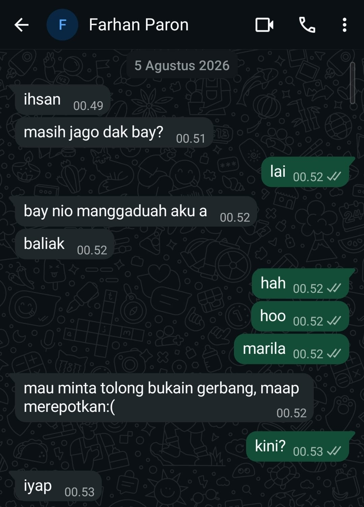

## Kompetensi target

Memisahkan event, fact, story, emotion, internal character, choice, dan action.

## Evidence wajib

- Satu episode komunikasi dengan diri sendiri.
- Initial story dan sedikitnya dua alternative narratives.
- Internal agreement dan bukti tindakan berikutnya.

::: {.callout-tip title="Lihat contoh pengisian"}
[Buka contoh fiktif Minggu 2](../examples/week-02.qmd) untuk melihat tingkat kekonkretan evidence dan analisis. Jangan menyalin contoh sebagai evidence pribadi.
:::

## Pembedahan Lapisan Batin

**Peristiwa yang dianalisis:**  
Pada 5 Agustus 2026 pukul 00.49 WIB, saya sedang beristirahat di kamar kos Bandung setelah seharian berkegiatan. Tiba-tiba masuk rentetan pesan WhatsApp dari kawan satu daerah asal, FP. Ia baru saja menyelesaikan acara di Bandung dan belum memiliki tempat tinggal di Bandung (kos aslinya berada di Jatinangor). FP berniat menumpang istirahat malam itu dan meminta tolong dibukakan gerbang kos.

| Lapisan Batin | Catatan Refleksi Pribadi |
|---|---|
| **Fact (Fakta Objektif)** | Pesan masuk pukul 00.49–00.52 WIB dari FP menanyakan apakah saya masih bangun, menyatakan ingin menumpang, dan meminta dibukakan gerbang kos. Belum ada penolakan atau penerimaan saat pesan pertama dibaca. |
| **Initial story (Asumsi Pertama)** | Muncul rasa kesal spontan: menganggap FP mengganggu jam istirahat malam dan mempertanyakan mengapa ia tidak mencari penginapan atau mengabari dari siang hari. |
| **Emotion & body signal** | Kaget, lelah fisik, rasa kantuk skala 7/10, mata terasa berat, dan tubuh enggan beranjak dari kasur. |
| **Reactive character** | Saya sebagai orang yang sedang lelah dan lebih ingin mempertahankan waktu istirahat, sehingga sempat terpikir untuk mengabaikan pesan. |
| **Desired character** | Saya sebagai teman yang bersedia membantu ketika kawan membutuhkan tempat untuk beristirahat pada malam hari. |

Cerita awal saya melampaui fakta: pesan FP bukanlah bentuk kesengajaan untuk mengganggu, melainkan kebutuhan mendesak dari kawan perantau yang kehabisan opsi tempat tinggal dini hari.

## Narasi Alternatif (Alternative Narratives)

1. **Perspektif Kebutuhan Darurat:**  
   FP baru selesai mengikuti suatu acara dan belum memiliki kos di Bandung. Permintaan untuk menumpang dan dibukakan gerbang menunjukkan bahwa ia membutuhkan tempat beristirahat malam itu. Kalimat "maap merepotkan:(" juga menunjukkan bahwa ia menyadari permintaannya dapat mengganggu waktu istirahat saya.
2. **Perspektif Nilai Persahabatan:**  
   Rasa lelah saya tetap nyata, tetapi membantu membukakan gerbang merupakan tindakan yang dapat saya lakukan untuk menolong teman yang sedang membutuhkan tempat beristirahat.
3. **Perspektif Tindakan yang Realistis:**  
   Saya tidak perlu langsung membuat banyak asumsi. Saya dapat memastikan apakah FP datang saat itu juga, lalu memutuskan tindakan berdasarkan jawaban yang diberikan.

Narasi alternatif kedua dan ketiga membantu saya beralih dari reaksi malas menuju tindakan nyata yang empatik.

## Percakapan Batin dan Kesepakatan Internal (Internal Agreement)

> **Dorongan awal:** "Saya sedang lelah dan ingin tetap beristirahat. Saya sempat berpikir untuk tidak membalas pesan."  
> **Pertimbangan lain:** "FP belum memiliki kos di Bandung dan sedang meminta bantuan. Saya masih dapat memastikan waktu kedatangannya sebelum turun membuka gerbang."  
> **Keputusan saya:** "Saya akan membalas pesannya dan menanyakan apakah ia datang sekarang. Jika iya, saya akan turun membukakan gerbang."  

**Internal agreement:** Membalas pesan FP sebelum pukul 00.53 WIB dengan konfirmasi kedatangan, lalu segera bangun dari kasur untuk turun ke lantai bawah dan membukakan pintu gerbang kos.

## Konteks Performance

**Tanggal dan setting:** 5 Agustus 2026 pukul 00.49–00.53 WIB, kamar kos saya di Bandung.

**Persons dan relationship:** Diri saya sendiri dan FP, kawan satu daerah asal di Minangkabau yang sama-sama merantau menempuh pendidikan tinggi di wilayah Bandung Raya. Hubungan akrab, setara, dan terbiasa saling membantu. Identitas disamarkan menggunakan inisial FP demi menjaga privasi.

**Objective dan initial state:**  
- **State Awal:** Tubuh lelah dan mengantuk, disertai dorongan untuk mengabaikan pesan dan tetap beristirahat.  
- **Objective:** Memastikan kebutuhan FP dan memberikan jawaban yang jelas mengenai permintaannya untuk menumpang.  
- **State Akhir:** Saya memutuskan untuk membantu, membalas dengan bahasa daerah yang biasa kami gunakan, dan memastikan waktu kedatangannya sebelum membukakan gerbang.

## Catatan Percakapan

> **FP, 00.49:** "ihsan"
>
> **FP, 00.51:** "masih jago dak bay?"
>
> **Saya, 00.52:** "lai"
>
> **FP, 00.52:** "bay nio manggaaduah aku a"
>
> **FP, 00.52:** "baliak"
>
> **Saya, 00.52:** "hah"
>
> **Saya, 00.52:** "hoo"
>
> **Saya, 00.52:** "marila"
>
> **FP, 00.52:** "mau minta tolong bukain gerbang, maap merepotkan:("
>
> **Saya, 00.53:** "kini?"
>
> **FP, 00.53:** "iyap"

Percakapan menggunakan bahasa Minang sebagai penanda keakraban. Kalimat "masih jago dak bay?" menanyakan apakah saya masih bangun. Pesan "bay nio manggaaduah aku a" dan "baliak" menyampaikan keinginan FP untuk kembali menumpang. Jawaban "lai" berarti saya masih bangun, "marila" mempersilakan FP datang, dan "kini?" memastikan apakah ia datang saat itu juga.

## Evidence Tindakan

::: {.evidence-block}
Berikut adalah bukti tangkapan layar percakapan WhatsApp antara saya dan FP pada dini hari tanggal 5 Agustus 2026. Bukti ini menunjukkan peralihan keputusan internal saya menjadi tindakan komunikasi yang menyambut:

:::

## Analisis Komunikasi

| Elemen | Evidence dan Analisis |
|---|---|
| **Person & character** | Saya memposisikan diri sebagai tuan rumah dan kawan perantau yang suportif. FP dihadapi sebagai manusia yang sedang terdesak kebutuhan tempat berteduh pada dini hari, bukan sebagai beban pengganggu tidur. |
| **Objective & state** | State awal adalah keengganan beranjak dari kasur karena lelah. Objective batin saya adalah mengalihkan fokus dari ketidaknyamanan pribadi ke pertolongan kawan. State akhir tercapai saat gerbang kos dibukakan dan FP dapat beristirahat. |
| **Repertoire & language** | Saya menggunakan dialek Minang santai (`"lai"`, `"marila"`, `"kini?"`) untuk mencairkan rasa sungkan FP yang merasa merepotkan (`"maap merepotkan:("`). |
| **Response & adaptation** | Melihat ekspresi rasa bersalah FP pada pesan chat, saya tidak mengeluhkan waktu kedatangannya yang larut, melainkan langsung meminta konfirmasi kepastian (`"kini?"`) agar ia merasa diterima. |
| **Agreement & action** | Terjadi kesepakatan instan: FP langsung menuju lokasi gerbang kos, dan saya bangkit turun dari lantai atas untuk membukakan gerbang serta menyambutnya masuk kamar. |
| **Relationship outcome** | Ikatan persaudaraan sesama perantau terjaga erat. FP merasa tertolong di saat darurat, dan saya belajar mengendalikan reaksi egois batin demi nilai kepedulian nyata. |

## Penggunaan AI

AI digunakan untuk membantu merapikan struktur dan bahasa. Isi pengalaman, percakapan, serta keputusan tetap saya periksa berdasarkan kejadian yang saya alami. Identitas rekan ditulis sebagai FP dalam narasi.

## Feedback dan Tindak Lanjut

**Feedback yang diterima:** FP menjawab "iyap" pada pukul 00.53 setelah saya menanyakan "kini?". Respons tersebut mengonfirmasi bahwa ia datang saat itu juga. Tidak ada kutipan feedback lanjutan yang saya lampirkan dalam evidence ini.

**Adaptation/replay:** Alih-alih mengabaikan pesan karena lelah, saya membalas dan menanyakan waktu kedatangan. Pertanyaan singkat tersebut memberi informasi yang saya perlukan untuk bertindak tanpa memperpanjang percakapan.

**Next practice:** Saat menerima kabar atau permintaan mendadak yang memicu rasa lelah atau kesal, saya akan mengambil jeda napas 30 detik untuk membedakan fakta kebutuhan orang lain dari cerita ego pribadi sebelum membalas pesan.

## Self-assessment

| Dimensi | Skor 1–4 | Evidence Singkat |
|---|---:|---|
| **Person & Character** | 3 | Dorongan untuk tetap beristirahat dibedakan dari pilihan saya sebagai teman yang bersedia membantu. Kondisi FP dipertimbangkan tanpa memberi label negatif. |
| **Objective & State** | 3 | Perubahan dari rasa kantuk/enggan menuju tindakan membukakan pintu terdokumentasi dengan batas waktu jelas. |
| **Repertoire, Language & AI** | 3 | Pemakaian bahasa Minang mencairkan rasa sungkan rekan. Deklarasi AI jujur dan mematuhi etika privasi. |
| **Response & Adaptation** | 3 | Menangkap sinyal rasa bersalah rekan dan segera mengalihkan fokus ke konfirmasi waktu tiba di gerbang. |
| **Agreement, Action & Relationship** | 3 | Kesepakatan tumpangan terlaksana dengan pembukaan gerbang. Hubungan pertemanan semakin solid dan saling percaya. |

**Total: 15 / 20 — Kompeten**

::: {.assessor-only}
### Assessment Dosen

**Skor:** — / 20  
**Evidence yang mendukung:** —  
**Prioritas perbaikan:** —  
**Keputusan:** Belum dinilai / Perlu revisi / Tercapai
:::
