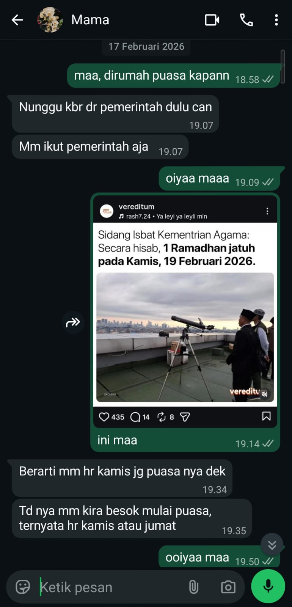

## Kompetensi target

Melakukan personal conversation dengan listening, clarity, boundary, dan relationship awareness.

## Evidence wajib

- Transcript atau catatan percakapan.
- Evidence listening dan response.
- Analisis relationship state sebelum dan sesudah.

::: {.callout-tip title="Lihat contoh pengisian"}
[Buka contoh fiktif Minggu 3](../examples/week-03.qmd) untuk melihat tingkat kekonkretan evidence dan analisis. Jangan menyalin contoh sebagai evidence pribadi.
:::

## Percakapan yang Dianalisis

Pada 17 Februari 2026, saya bertanya kepada ibu kapan keluarga di rumah akan mulai berpuasa Ramadan. Ibu menjawab bahwa ia masih menunggu kabar dari pemerintah dan akan mengikuti keputusan pemerintah.

Setelah memahami acuan yang dipilih ibu, saya mengirimkan unggahan media sosial yang menyebutkan bahwa berdasarkan perhitungan hisab, 1 Ramadan jatuh pada Kamis, 19 Februari 2026. Ibu kemudian mengatakan bahwa ia juga akan mulai berpuasa pada hari Kamis. Sebelumnya, ia mengira puasa dimulai keesokan harinya.

## Catatan Percakapan

> **Saya, 18.58:** "maa, dirumah puasa kapann"
>
> **Ibu, 19.07:** "Nunggu kbr dr pemerintah dulu can. Mm ikut pemerintah aja."
>
> **Saya, 19.09:** "oiyaa maaa"
>
> **Saya, 19.14:** "ini maa" disertai unggahan mengenai perkiraan awal Ramadan.
>
> **Ibu, 19.34:** "Berarti mm hr kamis jg puasa nya dek."
>
> **Ibu, 19.35:** "Td nya mm kira besok mulai puasa, ternyata hr kamis atau jumat."
>
> **Saya, 19.50:** "ooiyaa maa"

Percakapan ini menunjukkan bahwa jawaban ibu memengaruhi respons saya. Setelah mengetahui bahwa ibu menunggu pemerintah, saya tidak memperdebatkan pilihannya dan mencari informasi yang berkaitan dengan acuan tersebut.

## Evidence

::: {.evidence-block}
Tangkapan layar berikut menunjukkan pertanyaan saya, acuan yang dipilih ibu, informasi yang saya kirim, dan perubahan perkiraan waktu mulai berpuasa.

:::

## Listening dan Response

Listening dalam percakapan ini terlihat ketika saya memperhatikan dasar keputusan ibu, bukan hanya jawaban tanggalnya. Ibu menyatakan bahwa ia akan mengikuti pemerintah. Karena itu, saya mengirimkan informasi yang berkaitan dengan penetapan awal Ramadan. Ibu kemudian memperbarui perkiraannya dari "besok" menjadi Kamis, sambil masih menyebut kemungkinan Kamis atau Jumat.

Unggahan media sosial tersebut sesuai dengan konteks percakapan karena menyajikan informasi tanggal secara singkat dan visual. Ibu dapat memahami isinya dan menghubungkannya dengan rencana berpuasa. Untuk percakapan serupa, saya tetap dapat melengkapinya dengan sumber resmi agar tingkat kepastian informasinya lebih jelas.

## Relationship State Sebelum dan Sesudah

**Sebelum percakapan:** Hubungan kami dalam keadaan baik dan tidak sedang mengalami konflik. Namun, kami belum memiliki pemahaman yang sama mengenai waktu mulai berpuasa. Ibu mengira puasa mungkin dimulai keesokan hari, tetapi memilih menunggu pemerintah.

**Sesudah percakapan:** Ibu memperoleh informasi baru dan mengubah perkiraannya menjadi Kamis, meskipun keputusan akhirnya masih perlu menunggu pengumuman pemerintah. Percakapan tetap terbuka dan tidak berubah menjadi perdebatan. Saya menghormati bahwa keputusan berpuasa tetap berada pada ibu.

## Analisis Komunikasi

| Elemen | Evidence dan Analisis |
|---|---|
| **Person & character** | Saya berperan sebagai anak yang bertanya dan membantu mencari informasi. Ibu tetap diperlakukan sebagai orang yang menentukan pilihannya sendiri berdasarkan acuan yang ia percaya. |
| **Objective & state** | State awalnya adalah ketidakpastian mengenai tanggal mulai berpuasa. Objective saya adalah mengetahui rencana ibu. Setelah percakapan, ibu memiliki perkiraan baru, tetapi masih menunggu keputusan pemerintah. |
| **Repertoire & language** | Saya menggunakan pertanyaan langsung, bahasa keluarga yang santai, dan unggahan visual sebagai informasi tambahan. Bentuk tersebut sesuai dengan kebiasaan percakapan kami dan membantu ibu memahami informasi tanggal dengan cepat. |
| **Response & adaptation** | Jawaban ibu bahwa ia mengikuti pemerintah mengarahkan tindakan saya berikutnya. Saya menyesuaikan respons dengan mengirimkan informasi mengenai awal Ramadan, bukan memaksakan tanggal pilihan saya sendiri. |
| **Agreement & action** | Ibu menyatakan rencana untuk mulai berpuasa pada Kamis setelah membaca informasi yang saya kirim. Rencana tersebut masih bersifat sementara karena ia juga menyebut kemungkinan Kamis atau Jumat. |
| **Relationship outcome** | Percakapan tetap akrab dan terbuka. Perbedaan perkiraan tanggal dibahas tanpa konflik, dan keputusan akhir ibu tetap dihormati. |

## Penggunaan AI

AI digunakan untuk membantu merapikan struktur refleksi dan memeriksa kesesuaiannya dengan tugas Week 3. Isi percakapan dan keputusan ibu tetap ditulis berdasarkan evidence yang tersedia.

## Feedback dan Tindak Lanjut

**Feedback yang diterima:** Setelah membaca unggahan tersebut, ibu menjawab, "Berarti mm hr kamis jg puasa nya dek," dan menjelaskan bahwa sebelumnya ia mengira puasa dimulai keesokan hari.

**Adaptation/replay:** Saya menyesuaikan informasi dengan acuan yang disebutkan ibu. Jika mengulang percakapan ini, saya akan menambahkan sumber resmi sebagai pembanding agar informasi yang kami gunakan lebih lengkap.

**Next practice:** Ketika membagikan informasi yang memengaruhi keputusan keluarga, saya akan memeriksa sumber resmi dan menjelaskan tingkat kepastian informasinya sebelum menarik kesimpulan.

## Self-assessment

| Dimensi | Skor 1–4 | Evidence Singkat |
|---|---:|---|
| **Person & Character** | 3 | Acuan dan pilihan ibu diperhatikan tanpa mengambil alih keputusan pribadinya. |
| **Objective & State** | 3 | Ketidakpastian awal dan perubahan perkiraan tanggal terlihat dalam percakapan. |
| **Repertoire, Language & AI** | 3 | Pertanyaan langsung, bahasa keluarga, dan unggahan visual sesuai konteks serta dapat dipahami oleh ibu. |
| **Response & Adaptation** | 3 | Jawaban ibu mengenai acuannya mengubah respons saya dari bertanya menjadi mencari dan mengirim informasi yang relevan. |
| **Agreement, Action & Relationship** | 3 | Ibu menyampaikan rencana tindakannya, sementara percakapan tetap terbuka dan keputusan akhirnya dihormati. |

**Total: 15 / 20, Kompeten**

::: {.assessor-only}
### Assessment Dosen

**Skor:** — / 20  
**Evidence yang mendukung:** —  
**Prioritas perbaikan:** —  
**Keputusan:** Belum dinilai / Perlu revisi / Tercapai
:::
